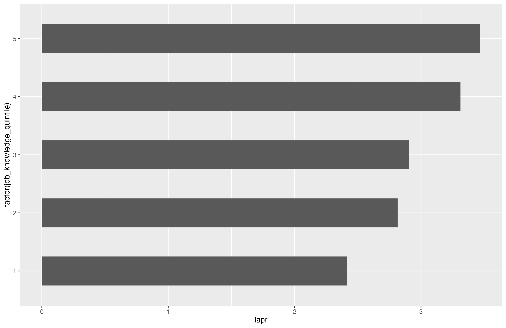

## Setup

As with the data and analysis sections, we'll need to call in our global scripts and the final dataset made earlier.

```{r}
#| message: false
source("global.R")
load("data/validation_final.Rdata")
```

## Data Visualization

Here's a good spot to make some data visualizations for exploratory or event publication ready figures. Adding this reference to @fig-1 allows readers to hover over the refence to preview the figure which can be helpful if you have long blocks of text and are discussing a figure which may not appear for a while.

https://github.com/quarto-dev/quarto-cli/discussions/4655

If you're just going to have an HTML document without a PDF, I'd recommend leaning on the `embed-resources: true` in the `_quarto.yml` file. When this is used, you don't need to seperately store your figures and then display them using Markdown (e.g., ``). They can, insead, simply be labelled in the R code chunk itself (e.g., `#| label: fig-1`)

## Simple Figure

@fig-1 is an example of a simple figure which can quickly be put together for exploratory purposes. You'll notice the @fig-1 is automatically named when the document is numbered with the option `numbered-sections: true` in the `_quarto.yml` file. This is also the default. If you chose `false` the figure and cross-reference will be titled whatever is in the parenthesis.

```{r}
fig1 <- ggplot(data = df, aes(x = lapr, y = factor(job_knowledge_quintile))) +
    geom_bar(stat = "summary", fun = mean, width = .5) 
```

{#fig-1}

## Publication Ready Figure

@fig-2 is a the same figure as above, just made a little more polished for publication.

```{r}
fig2 <- ggplot(data = df, aes(x = lapr, y = factor(job_knowledge_quintile))) +
    geom_bar(stat = "summary", fun = mean, width = .5) +
    geom_text(aes(label = nround(after_stat(x),2)), 
                   stat = "summary", 
                   fun = "mean",
                   size = 20/.pt,
                   hjust = -.2) +
    coord_cartesian(xlim = c(1,5)) +
    labs(
        title = "Average Performance by Job Knowledge Quintile",
        x = "Average Last Annual Performance Review Rating",
        y = "Job Knowledge Test Quintile"
    ) +
    theme_minimal(base_size = 20) +
    theme(
        axis.text.x = element_blank(),
        axis.text.y = element_text(size = 20),
        panel.grid = element_blank()
        )
```

{#fig-2}

## Figure Export

It's often important to have figures in a format suitable for manuscripts or other programs. We also need to export the figures for later reference in markdown format using ``.

```{r}
ggsave(
    plot = fig1,
    filename = "figures/Figure1.png",
    height = 6.5,
    width = 10,
    units = "in"
    )

ggsave(
    plot = fig2,
    filename = "figures/Figure2.png",
    height = 6.5,
    width = 10,
    units = "in"
    )
```